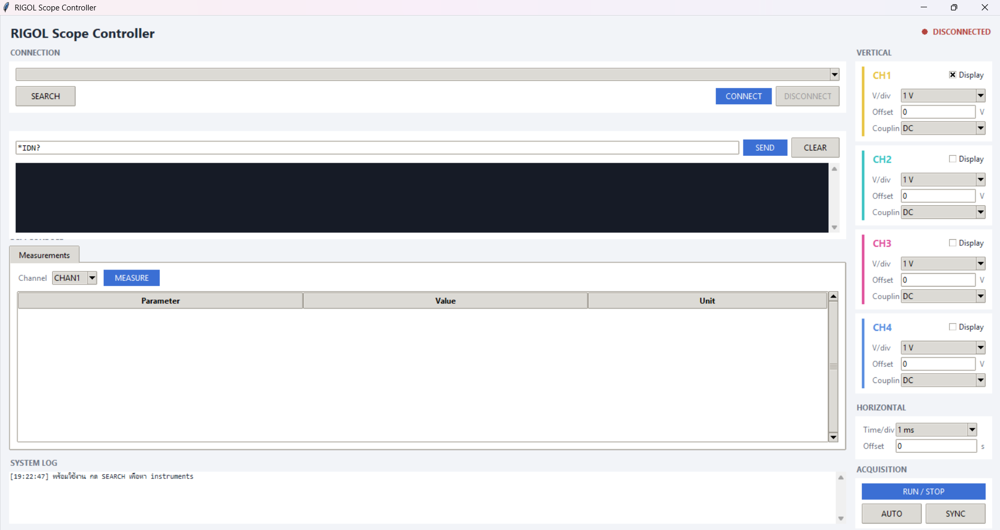
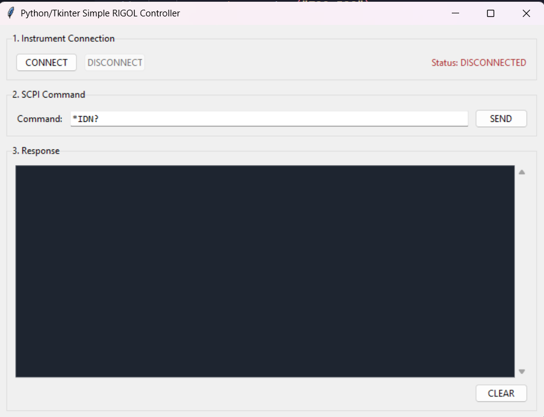
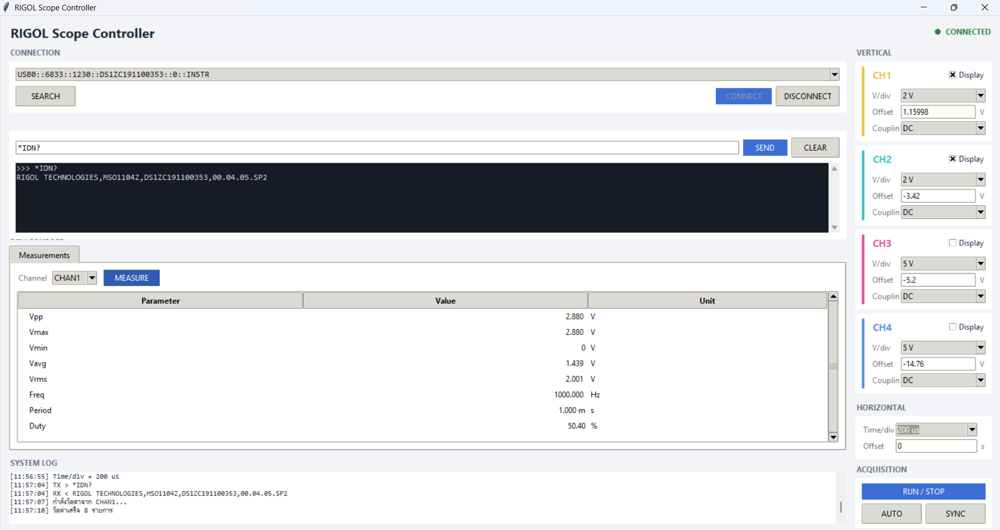
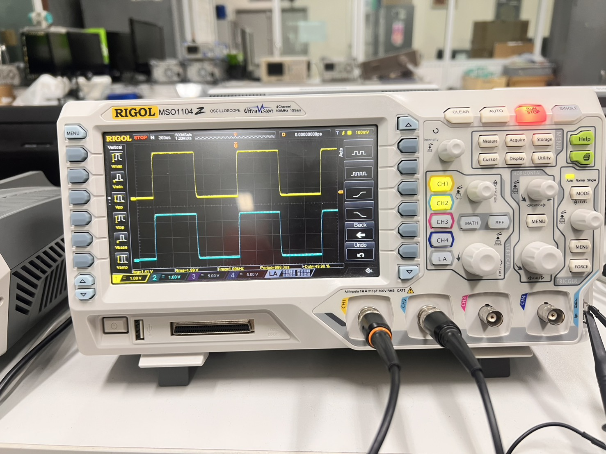

# RIGOL Scope Controller

Desktop GUI application สำหรับควบคุม oscilloscope RIGOL ผ่าน USB ด้วยคำสั่ง SCPI
เขียนด้วย Python/Tkinter สื่อสารกับเครื่องมือวัดผ่าน PyVISA

**วิชา:** Software Development Practice 1 — Task 2



## Objectives

- พัฒนา desktop GUI application ด้วย Python และ Tkinter
- สื่อสารกับ oscilloscope RIGOL ผ่าน USB ด้วยคำสั่ง SCPI (PyVISA/PyUSB)
- ประยุกต์หลัก Object-Oriented Programming ในการจัดโครงสร้างโปรแกรม
- เชื่อม GUI event handling เข้ากับการสื่อสารกับเครื่องมือวัด

## Features

**Connection**
- ค้นหา VISA instruments ที่ต่ออยู่อัตโนมัติ แล้วเลือกตัวแรกให้เลย
- Connect / Disconnect พร้อมแสดงสถานะแบบ real-time
- ตอน connect สำเร็จจะ sync ค่าจาก scope มาแสดงทันที

**SCPI Console**
- พิมพ์คำสั่ง SCPI ส่งเองได้อิสระ พร้อมแสดง response
- แยก query กับ write command อัตโนมัติ (ดูจากว่ามี `?` ไหม)
- กด Enter ในช่องคำสั่งแทนการกดปุ่ม SEND ได้

**Channel Control (CH1–CH4)**
- เปิด/ปิดการแสดงผลแต่ละ channel
- ตั้ง V/div, vertical offset, coupling (DC/AC/GND)

**Horizontal & Acquisition**
- ตั้ง time/div และ time offset
- RUN/STOP, AUTO (autoscale), SYNC

**Waveform Measurements**
- อ่าน Vpp, Vmax, Vmin, Vavg, Vrms, Freq, Period, Duty ของ channel ที่เลือก
- แสดงในตารางพร้อมหน่วยที่จัดรูปแบบให้อ่านง่าย

**System Log**
- บันทึกทุกคำสั่งที่ส่ง (TX) และ response ที่ได้รับ (RX) พร้อม timestamp

## Requirements

- RIGOL digital oscilloscope (ทดสอบกับ MSO1104Z) + สาย USB Type-B
- Windows 10/11 (64-bit) หรือ Linux
- Python 3.8+

| Package | หน้าที่ |
|---|---|
| `pyvisa` | high-level API สำหรับสื่อสารกับเครื่องมือวัด |
| `pyvisa-py` | VISA backend แบบ pure-Python ไม่ต้องลง NI-VISA |
| `pyusb` | เข้าถึงอุปกรณ์ USB จาก Python |
| `zeroconf`, `psutil` | dependency ของ pyvisa-py |

## Installation

```bash
git clone https://github.com/USERNAME/rigol-scope-controller.git
cd rigol-scope-controller

python -m venv venv
.\venv\Scripts\activate          # Windows
# source venv/bin/activate       # Linux/macOS

pip install pyusb pyvisa pyvisa-py zeroconf psutil
```

**ติดตั้ง USB driver (Windows เท่านั้น)**

Windows ไม่มี driver ให้ PyUSB คุยกับ USBTMC โดยตรง ต้องใช้ [Zadig](https://zadig.akeo.ie/) ลง libusb เป็นตัวกลาง:

1. ต่อสาย USB จาก scope เข้าคอมพิวเตอร์
2. เปิด Zadig → **Options** → ติ๊ก **List All Devices**
3. เลือก scope จาก dropdown (ชื่อประมาณ `DS1000Z Series`)
4. เลือก driver ปลายทางเป็น **libusb-win32** → กด **Replace Driver**

> ขั้นตอนนี้ทำครั้งเดียวต่อเครื่อง หากข้ามไป `list_resources()` จะไม่เจอ scope ทั้งที่โค้ดถูกต้อง

## Usage

```bash
python rigol_controller.py
```

1. ต่อสาย USB จาก scope
2. กด **SEARCH** — หาอุปกรณ์และเลือกตัวแรกให้อัตโนมัติ
3. กด **CONNECT** — เชื่อมต่อและดึงค่าปัจจุบันจาก scope มาแสดง
4. ทดสอบด้วย `*IDN?` ในช่อง Command แล้วกด **SEND**

ตัวอย่างคำสั่งที่ใช้บ่อย: `:RUN` / `:STOP` (เริ่ม/หยุดเก็บ waveform), `:AUT` (autoscale), `:MEAS:VPP? CHAN1` (อ่านแรงดัน peak-to-peak)

## GUI Design

จัด layout แบบ 2 คอลัมน์ แบ่งตามลักษณะการใช้งาน — ฝั่งซ้ายเป็นส่วนที่ต้องอ่านผลลัพธ์ (connection, SCPI console, measurements, log) ฝั่งขวาเป็นส่วนควบคุมที่กดแล้วมีผลกับ scope ทันที (channel, horizontal, acquisition) การแยกแบบนี้ทำให้ไม่ต้องสลับไปมาระหว่างการสั่งงานกับการดูผล

**V/div และ time/div ใช้ combobox ไม่ใช่ช่องป้อนค่า**

scope RIGOL รับค่าเฉพาะที่เป็น step 1-2-5 (1 mV, 2 mV, 5 mV, 10 mV, 20 mV...) ไม่ใช่ค่าต่อเนื่อง ถ้าส่ง `:CHAN1:SCAL 3.7` ไป scope จะปัดเป็น 5 V เองแล้วไม่บอกอะไร ผู้ใช้จะงงว่าทำไมค่าไม่ตรงกับที่พิมพ์ การให้เลือกจาก dropdown ที่มีแต่ค่าที่ใช้ได้จริงจึงตรงกับความสามารถของเครื่องมากกว่า และไม่ต้อง validate input เอง

ส่วน offset ป้อนค่าเองได้เพราะเป็นค่าต่อเนื่องจริง ไม่มีข้อจำกัดเรื่อง step

**ปุ่ม SYNC**

GUI กับ scope ต่างจำค่าของตัวเอง ถ้าเปลี่ยนค่าจาก GUI มันจะส่งคำสั่งไปบอก scope สองฝั่งตรงกัน แต่ถ้าผู้ใช้เดินไปหมุนปุ่มที่ตัว scope โดยตรง GUI จะไม่รู้เรื่องและแสดงค่าเก่าค้างไว้ ปุ่ม SYNC ยิง query (`:CHAN1:SCAL?` ฯลฯ) ไปถามค่าปัจจุบันแล้วอัปเดต widget ให้ตรง

SYNC ถูกเรียกอัตโนมัติ 2 จังหวะ: หลัง connect สำเร็จ (จะได้เริ่มด้วยค่าจริงไม่ใช่ค่า default) และหลังกด AUTO (เพราะ autoscale ทำให้ scope เปลี่ยนค่าเองหมด)

**สีประจำ channel** ใช้สีเดียวกับที่แสดงบนหน้าจอ scope เพื่อให้เชื่อมโยงกันได้ทันทีโดยไม่ต้องอ่านตัวหนังสือ

**แยก Response กับ System Log** — Response แสดงเฉพาะผลของคำสั่งที่ผู้ใช้พิมพ์เอง ส่วน Log บันทึกทุกอย่างที่โปรแกรมทำรวมถึงคำสั่งที่เกิดจากการกดปุ่ม ทำให้ debug ง่ายเวลาไม่แน่ใจว่าโปรแกรมส่งอะไรไปบ้าง

## OOP Class Structure

โปรแกรมแบ่งเป็น 3 คลาส แยกตามหน้าที่ชัดเจน

**`ScopeController`** — รับผิดชอบการสื่อสารกับ scope ทั้งหมด ไม่มีโค้ด GUI อยู่เลยแม้แต่บรรทัดเดียว

```
search()                     ค้นหา USB instruments ที่ต่ออยู่
connect() / disconnect()     จัดการ VISA resource
write() / query()            ส่งคำสั่ง SCPI
set_vdiv() / get_vdiv()      ควบคุมและอ่านค่า channel
set_tdiv() / get_tdiv()      ควบคุมและอ่านค่า timebase
measure()                    อ่านค่าวัดทั้งหมดของ channel ที่ระบุ
```

ข้อดีของการแยกแบบนี้คือเปลี่ยนวิธีสื่อสารได้โดยไม่ต้องแตะ GUI เลย เช่นถ้าจะเปลี่ยนจาก USB เป็น LAN ก็แก้แค่ `connect()` ในคลาสนี้ หรือถ้าจะเปลี่ยนไปใช้ scope ยี่ห้ออื่นที่ใช้คำสั่งต่างกัน ก็แก้แค่คลาสนี้เหมือนกัน

**`ChannelPanel`** — การ์ดควบคุม 1 channel สืบทอดจาก `ttk.Frame` ประกอบด้วย checkbox เปิด/ปิด, V/div, offset, coupling

แยกเป็นคลาสเพราะทั้ง 4 channel มีหน้าตาและพฤติกรรมเหมือนกันหมด ถ้าเขียนซ้ำ 4 รอบจะยาวและแก้ยาก การทำเป็นคลาสแล้วสร้าง 4 instance ทำให้เพิ่ม/ลด channel ได้ง่ายและแก้จุดเดียวมีผลทุกที่

**`App`** — จัดการ GUI ทั้งหมด คุยกับ scope ผ่าน `ScopeController` เท่านั้น ไม่เรียก pyvisa ตรงๆ

- `_build_*()` — สร้างและจัดวาง widget แยกเป็นส่วนๆ ไม่รวมเป็นก้อนเดียว
- `on_*()` — event handler ที่ผูกกับปุ่มผ่าน `command=`
- `safe_call()` — helper ที่รวม try/except ไว้ที่เดียว ปุ่มต่างๆ เรียกผ่านตัวนี้แทนที่จะเขียน try/except ซ้ำทุกอัน
- `log()` — เขียน System Log พร้อม timestamp

**Error handling** — ทุกจุดที่สื่อสารกับ scope ครอบด้วย `try/except` โปรแกรมจะไม่ crash เมื่อยังไม่ได้ลง pyvisa, ไม่พบอุปกรณ์, เชื่อมต่อไม่สำเร็จ, scope ไม่ตอบสนอง (timeout) หรือส่งคำสั่งที่ scope ไม่รู้จัก ข้อความ error จะแสดงใน System Log ทันทีแทนที่จะเด้งออก

## Screenshots

**GUI เวอร์ชันแรก (preliminary)** — โครงพื้นฐาน มีเฉพาะ connection, SCPI command และ response



**GUI เวอร์ชันสมบูรณ์ (completed)** — เพิ่ม channel control, timebase, measurements และ system log


**การสื่อสารกับ scope สำเร็จ** — response ของคำสั่ง `*IDN?`



**หน้าจอ oscilloscope ขณะทดสอบ** — สัญญาณ 1 kHz ที่ CH1


```
RIGOL TECHNOLOGIES,MSO1104Z,DS1ZC191100353,00.04.05.SP2
```

## Known Limitations

**Screen capture (`:DISP:DATA?`) ใช้งานไม่ได้กับ pyvisa-py**

พยายามทำฟีเจอร์ดึงภาพหน้าจอ scope แต่ไม่สำเร็จ ลองหลายวิธีแล้ว — `query_binary_values()`, `write()` + `read_raw()`, ปรับ chunk size ทั้งใหญ่และเล็ก, ขยาย timeout ถึง 60 วินาที, ลองทั้ง PNG และ BMP24 — ทุกครั้งได้ `VI_ERROR_TMO` ขณะที่คำสั่งอื่นที่ตอบข้อมูลสั้น (`*IDN?`, `:MEAS:VPP?`) ทำงานปกติทุกครั้ง

สรุปได้ว่าเป็นข้อจำกัดของ pyvisa-py ที่จัดการ USBTMC bulk transfer ขนาดใหญ่ (~1 MB) ไม่ได้ ไม่ใช่ปัญหาที่โค้ดหรือตัวคำสั่ง หากต้องการฟีเจอร์นี้ต้องเปลี่ยนไปใช้ NI-VISA (driver จาก vendor) หรือเชื่อมต่อผ่าน LAN ซึ่งไม่มีข้อจำกัดแบบ USBTMC
